## Tikz1

| [**`random.tex`**](Tikz1/data/random/random.tex)              | [**`network.tex`**](Tikz1/data/network/network.tex)           |
| :-----------------------------------------------------: | :-----------------------------------------------------: |
| 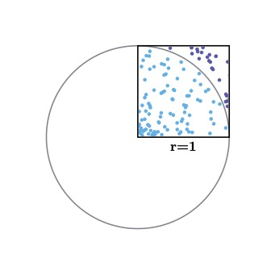                       | 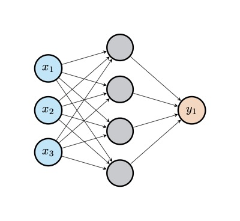                    |
| [**`cnn.tex`**](Tikz1/data/cnn/cnn.tex)                       | [**`turek.tex`**](Tikz1/data/turek/turek.tex)                 |
| 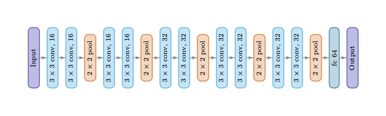                                | 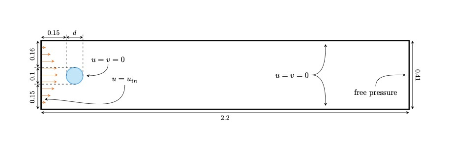                          |
| [**`workflow.tex`**](Tikz1/data/workflow/workflow.tex)        | [**`lorenz.tex`**](Tikz1/data/lorenz/lorenz.tex)              |
|                  | 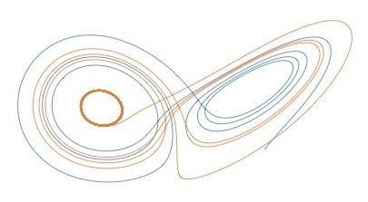                       |
| [**`git.tex`**](Tikz1/data/git/git.tex)                       | [**`minted.tex`**](Tikz1/data/minted/minted.tex)              |
| 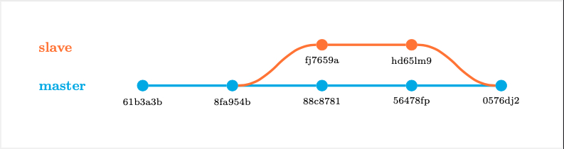                                | 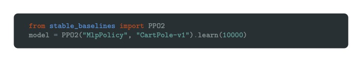                       |
| [**`timeline.tex`**](Tikz1/data/timeline/timeline.tex)        | [**`control.tex`**](Tikz1/data/control/control.tex)           |
| 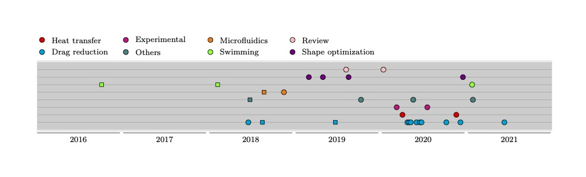                 | 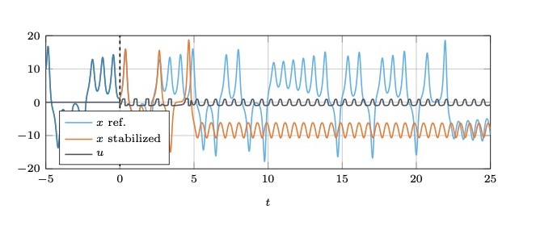                    |
| [**`letter.tex`**](Tikz1/data/letter/letter.tex)              | [**`beamer.tex`**](Tikz1/data/beamer/beamer.tex)              |
| 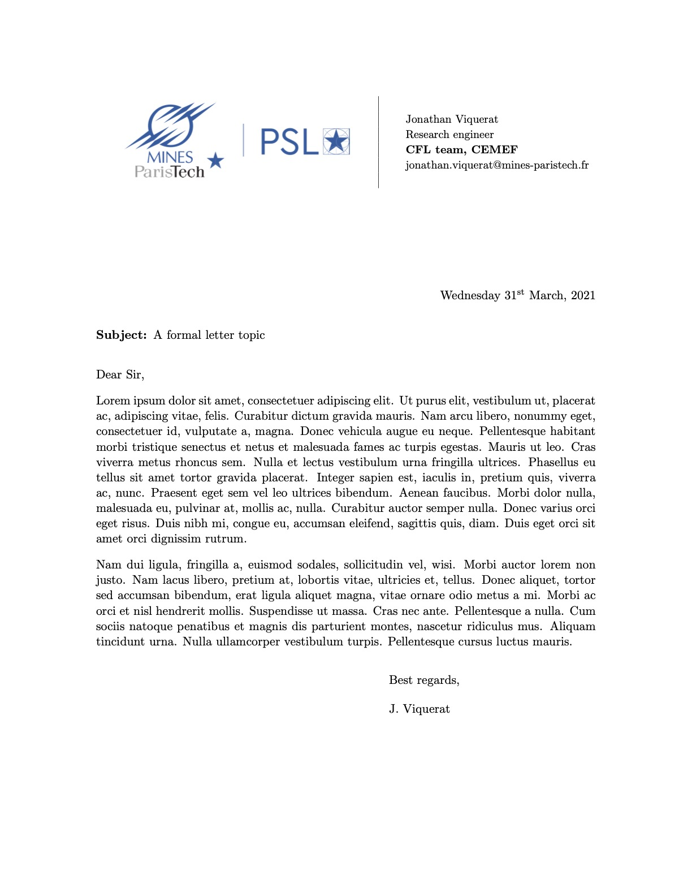                       |                        |
| [**`cfef.tex`**](Tikz1/data/cfef/cfef.tex)                    | [**`rosenbrock.tex`**](Tikz1/data/rosenbrock/rosenbrock.tex)  |
| 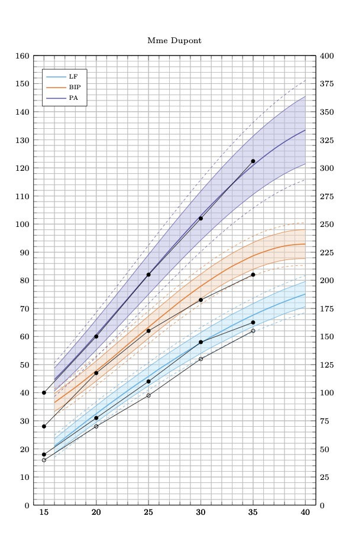                             | 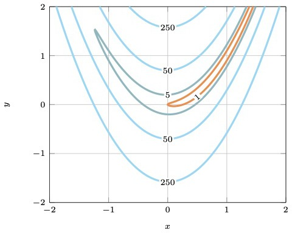           |
| [**`kdtree.tex`**](Tikz1/data/kdtree/kdtree.tex)              | [**`interface.tex`**](Tikz1/data/interface/interface.tex)     |
| 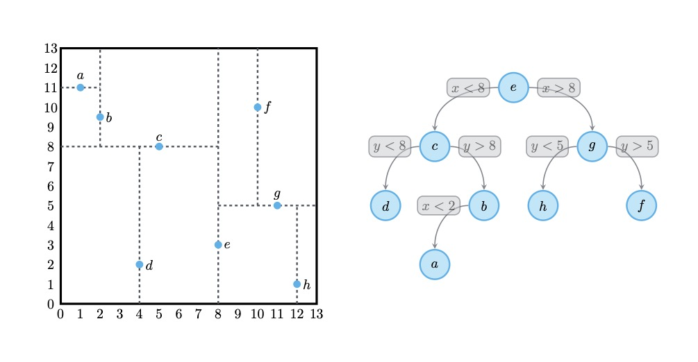                       | 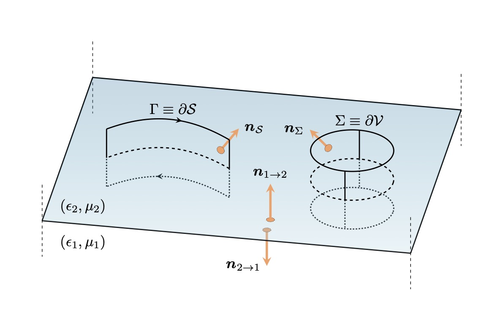              |
| [**`maxwell.tex`**](Tikz1/data/maxwell/maxwell.tex)           | [**`slab.tex`**](Tikz1/data/slab/slab.tex)                    |
| 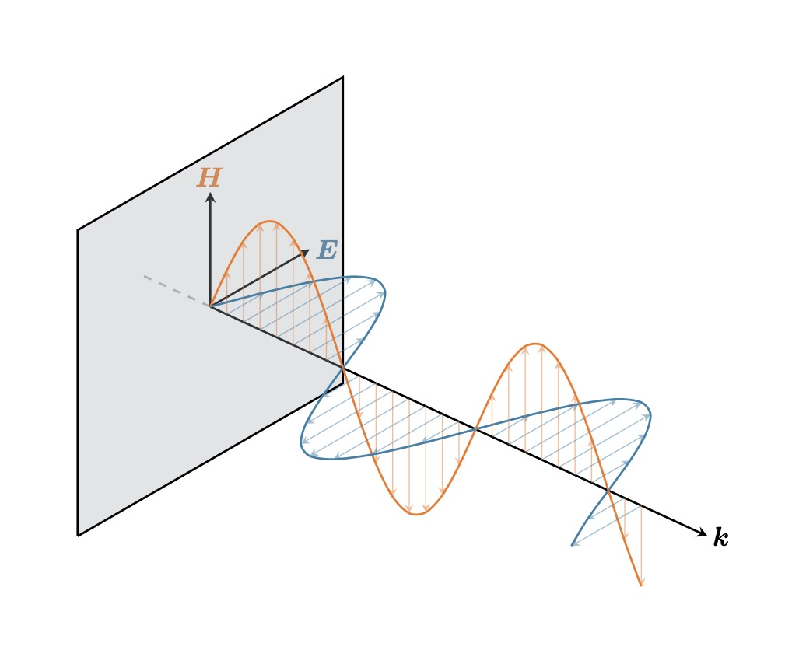                    | 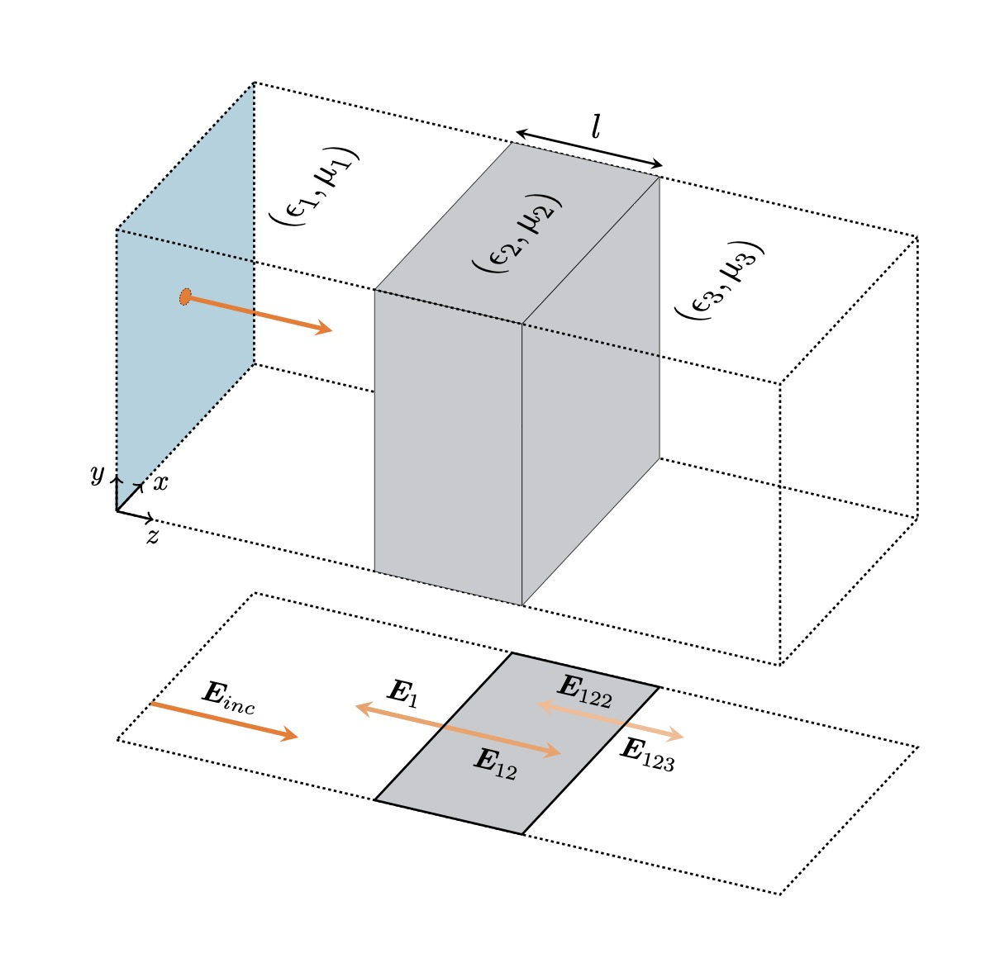                             |
| [**`oblique.tex`**](Tikz1/data/oblique/oblique.tex)           |                                                               |
| 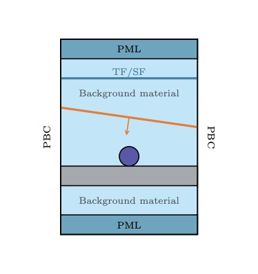                    |                                                               |
     

## Tikz2

| &emsp;&emsp;&emsp;&emsp;&emsp;&emsp;&emsp;&emsp;&emsp;&emsp;&emsp;&emsp;&emsp;&emsp;&emsp;&emsp;&emsp;&emsp;&emsp;&emsp;&emsp;&emsp; | &emsp;&emsp;&emsp;&emsp;&emsp;&emsp;&emsp;&emsp;&emsp;&emsp;&emsp;&emsp;&emsp;&emsp;&emsp;&emsp;&emsp;&emsp;&emsp;&emsp;&emsp;&emsp; |
| :----------------------------------------------------------------------------------------------------------------------------------: | :----------------------------------------------------------------------------------------------------------------------------------: |
|                                      [`autoencoder`](Tikz2/assets/autoencoder/autoencoder.tex)                                      |                                           [`aviary`](Tikz2/assets/aviary/aviary.tex)                                           |
|                                                                              |                                                                                             |
|                               [`basis-plus-lattice`](Tikz2/assets/basis-plus-lattice/basis-plus-lattice.tex)                               |                                     [`bloch-sphere`](Tikz2/assets/bloch-sphere/bloch-sphere.tex)                                     |
|                                                         |                                                                           |
|                    [`bose-einstein-distribution-3d`](Tikz2/assets/bose-einstein-distribution-3d/bose-einstein-distribution-3d.tex)                    |                       [`bose-einstein-distribution`](Tikz2/assets/bose-einstein-distribution/bose-einstein-distribution.tex)                       |
|                        |                                 |
|                                 [`branch-and-bound`](Tikz2/assets/branch-and-bound/branch-and-bound.tex)                                 |                                    [`branch-cuts-1`](Tikz2/assets/branch-cuts-1/branch-cuts-1.tex)                                    |
|                                                               |                                                                        |
|                                    [`branch-cuts-2`](Tikz2/assets/branch-cuts-2/branch-cuts-2.tex)                                    |                              [`change-of-variables`](Tikz2/assets/change-of-variables/change-of-variables.tex)                              |
|                                                                        |                                                      |
|                         [`closed-string-topologies`](Tikz2/assets/closed-string-topologies/closed-string-topologies.tex)                         |                            [`complex-sign-function`](Tikz2/assets/complex-sign-function/complex-sign-function.tex)                            |
|                                       |                                                |
|                                [`concave-functions`](Tikz2/assets/concave-functions/concave-functions.tex)                                |                                           [`conv2d`](Tikz2/assets/conv2d/conv2d.tex)                                           |
|                                                            |                                                                                             |
|                                 [`convex-functions`](Tikz2/assets/convex-functions/convex-functions.tex)                                 |                             [`critical-temperature`](Tikz2/assets/critical-temperature/critical-temperature.tex)                             |
|                                                               |                                                   |
|                                [`cylinder-to-plane`](Tikz2/assets/cylinder-to-plane/cylinder-to-plane.tex)                                |                                 [`detailed-balance`](Tikz2/assets/detailed-b

Tikz3

