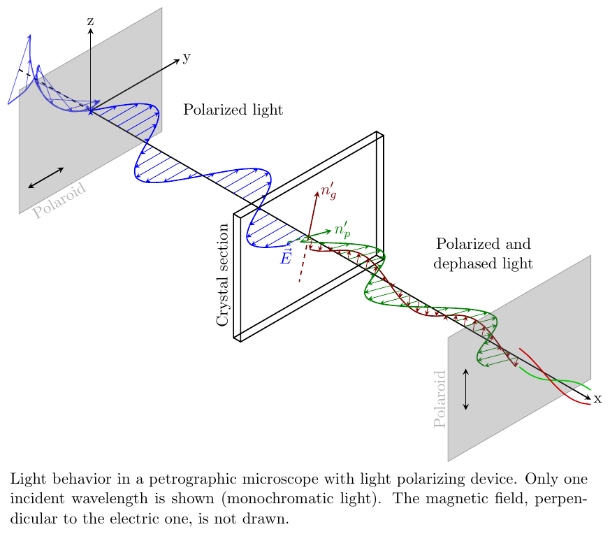
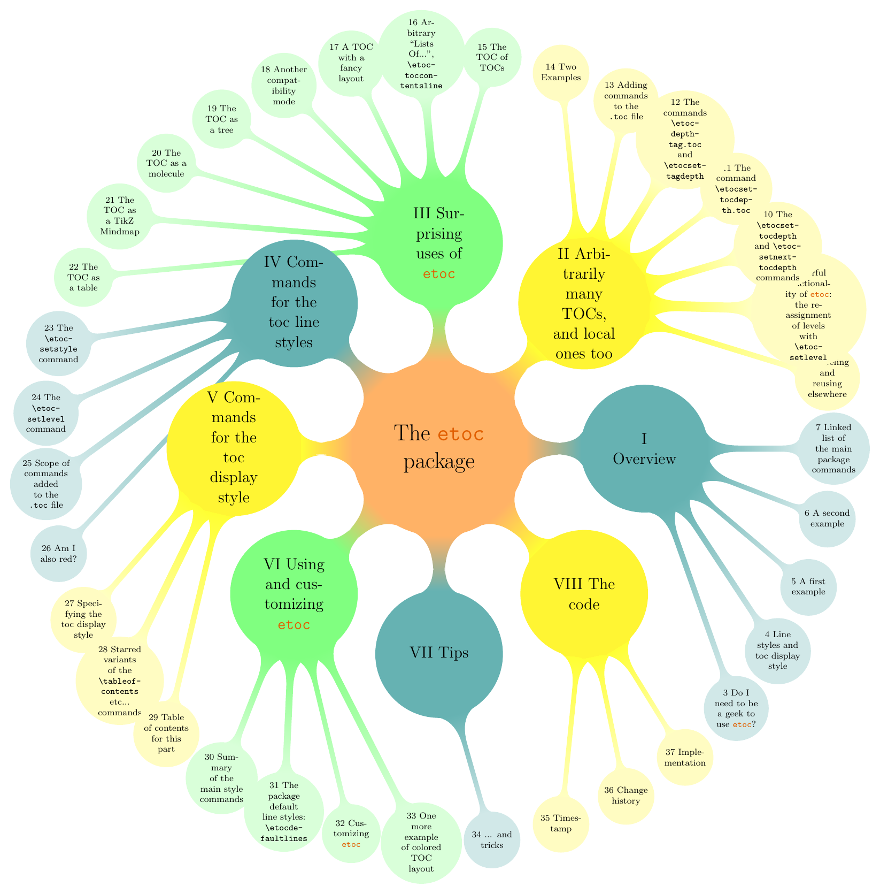

## Tikz Diagram Repository

Whole buncha LaTeX Tikz diagrams I found and put together for future references.

## Tikz1

| [**`random.tex`**](Tikz1/data/random/random.tex)              | [**`network.tex`**](Tikz1/data/network/network.tex)           |
| :-----------------------------------------------------: | :-----------------------------------------------------: |
|                        |                     |
| [**`cnn.tex`**](Tikz1/data/cnn/cnn.tex)                       | [**`turek.tex`**](Tikz1/data/turek/turek.tex)                 |
|                                 |                           |
| [**`workflow.tex`**](Tikz1/data/workflow/workflow.tex)        | [**`lorenz.tex`**](Tikz1/data/lorenz/lorenz.tex)              |
|                  |                        |
| [**`git.tex`**](Tikz1/data/git/git.tex)                       | [**`minted.tex`**](Tikz1/data/minted/minted.tex)              |
|                                 |                        |
| [**`timeline.tex`**](Tikz1/data/timeline/timeline.tex)        | [**`control.tex`**](Tikz1/data/control/control.tex)           |
|                  |                     |
| [**`letter.tex`**](Tikz1/data/letter/letter.tex)              | [**`beamer.tex`**](Tikz1/data/beamer/beamer.tex)              |
|                        |                        |
| [**`cfef.tex`**](Tikz1/data/cfef/cfef.tex)                    | [**`rosenbrock.tex`**](Tikz1/data/rosenbrock/rosenbrock.tex)  |
|                              |            |
| [**`kdtree.tex`**](Tikz1/data/kdtree/kdtree.tex)              | [**`interface.tex`**](Tikz1/data/interface/interface.tex)     |
|                        |               |
| [**`maxwell.tex`**](Tikz1/data/maxwell/maxwell.tex)           | [**`slab.tex`**](Tikz1/data/slab/slab.tex)                    |
|                     |                              |
| [**`oblique.tex`**](Tikz1/data/oblique/oblique.tex)           |                                                               |
|                     |                                                               |
     
## Tikz2

| &emsp;&emsp;&emsp;&emsp;&emsp;&emsp;&emsp;&emsp;&emsp;&emsp;&emsp;&emsp;&emsp;&emsp;&emsp;&emsp;&emsp;&emsp;&emsp;&emsp;&emsp;&emsp; | &emsp;&emsp;&emsp;&emsp;&emsp;&emsp;&emsp;&emsp;&emsp;&emsp;&emsp;&emsp;&emsp;&emsp;&emsp;&emsp;&emsp;&emsp;&emsp;&emsp;&emsp;&emsp; |
| :----------------------------------------------------------------------------------------------------------------------------------: | :----------------------------------------------------------------------------------------------------------------------------------: |
|                                      [`autoencoder`](Tikz2/assets/autoencoder/autoencoder.tex)                                      |                                           [`aviary`](Tikz2/assets/aviary/aviary.tex)                                           |
|                                                                              |                                                                                             |
|                               [`basis-plus-lattice`](Tikz2/assets/basis-plus-lattice/basis-plus-lattice.tex)                               |                                     [`bloch-sphere`](Tikz2/assets/bloch-sphere/bloch-sphere.tex)                                     |
|                                                         |                                                                           |
|                    [`bose-einstein-distribution-3d`](Tikz2/assets/bose-einstein-distribution-3d/bose-einstein-distribution-3d.tex)                    |                       [`bose-einstein-distribution`](Tikz2/assets/bose-einstein-distribution/bose-einstein-distribution.tex)                       |
|                        |                                 |
|                                 [`branch-and-bound`](Tikz2/assets/branch-and-bound/branch-and-bound.tex)                                 |                                    [`branch-cuts-1`](Tikz2/assets/branch-cuts-1/branch-cuts-1.tex)                                    |
|                                                               |                                                                        |
|                                    [`branch-cuts-2`](Tikz2/assets/branch-cuts-2/branch-cuts-2.tex)                                    |                              [`change-of-variables`](Tikz2/assets/change-of-variables/change-of-variables.tex)                              |
|                                                                        |                                                      |
|                         [`closed-string-topologies`](Tikz2/assets/closed-string-topologies/closed-string-topologies.tex)                         |                            [`complex-sign-function`](Tikz2/assets/complex-sign-function/complex-sign-function.tex)                            |
|                                       |                                                |
|                                [`concave-functions`](Tikz2/assets/concave-functions/concave-functions.tex)                                |                                           [`conv2d`](Tikz2/assets/conv2d/conv2d.tex)                                           |
|                                                            |                                                                                             |
|                                 [`convex-functions`](Tikz2/assets/convex-functions/convex-functions.tex)                                 |                             [`critical-temperature`](Tikz2/assets/critical-temperature/critical-temperature.tex)                             |
|                                                               |                                                   |
|                                      [`cylinder-to-plane`](Tikz2/assets/cylinder-to-plane/cylinder-to-plane.tex)                                      |                                           [`detailed-balance`](Tikz2/assets/detailed-balance/detailed-balance.tex)                                           |
|                                                                              |                                                                                             |
|                               [`dft-choices`](Tikz2/assets/dft-choices/dft-choices.tex)                               |                                     [`diagrams`](Tikz2/assets/diagrams/diagrams.tex)                                     |
|                                                         |                                                                           |
|                    [`disk-to-plane`](Tikz2/assets/disk-to-plane/disk-to-plane.tex)                    |                       [`divergence`](Tikz2/assets/divergence/divergence.tex)                       |
|                        |                                 |
|                                 [`dropout`](Tikz2/assets/dropout/dropout.tex)                                 |                                    [`energy-distribution-functions`](Tikz2/assets/energy-distribution-functions/energy-distribution-functions.tex)                                    |
|                                                               |                                                                        |
|                                    [`ergodic`](Tikz2/assets/ergodic/ergodic.tex)                                    |                              [`euler-angles`](Tikz2/assets/euler-angles/euler-angles.tex)                              |
|                                                                        |                                                      |
|                         [`fermi-dirac-vs-temp`](Tikz2/assets/fermi-dirac-vs-temp/fermi-dirac-vs-temp.tex)                         |                            [`feynman-1`](Tikz2/assets/feynman-1/feynman-1.tex)                            |
|                                       |                                                |
|                                [`feynman-2`](Tikz2/assets/feynman-2/feynman-2.tex)                                |                                           [`feynman-3`](Tikz2/assets/feynman-3/feynman-3.tex)                                           |
|                                                            |                                                                                             |
|                                 [`feynman-4`](Tikz2/assets/feynman-4/feynman-4.tex)                                 |                             [`feynman-diagram-propagator-loop`](Tikz2/assets/feynman-diagram-propagator-loop/feynman-diagram-propagator-loop.tex)                             |
|                                                               |                                                   |
| [`fluctuations`](Tikz2/assets/fluctuations/fluctuations.tex) | [`four-vs-of-data`](Tikz2/assets/four-vs-of-data/four-vs-of-data.tex) |
|  |  |
| [`gan`](Tikz2/assets/gan/gan.tex) | [`geometric-bayes`](Tikz2/assets/geometric-bayes/geometric-bayes.tex) |
|  |  |
| [`graph-isomorphism`](Tikz2/assets/graph-isomorphism/graph-isomorphism.tex) | [`gravitons`](Tikz2/assets/gravitons/gravitons.tex) |
|  |  |
| [`harm-osc-energy-freq`](Tikz2/assets/harm-osc-energy-freq/harm-osc-energy-freq.tex) | [`harm-osc-energy-inv-temp`](Tikz2/assets/harm-osc-energy-inv-temp/harm-osc-energy-inv-temp.tex) |
|  |  |
| [`hea`](Tikz2/assets/hea/hea.tex) | [`heatmap`](Tikz2/assets/heatmap/heatmap.tex) |
|  |  |
| [`higgs-potential`](Tikz2/assets/higgs-potential/higgs-potential.tex) | [`isotherms`](Tikz2/assets/isotherms/isotherms.tex) |
|  |  |
| [`jensens-inequality`](Tikz2/assets/jensens-inequality/jensens-inequality.tex) | [`k-space`](Tikz2/assets/k-space/k-space.tex) |
|  |  |
| [`kohn-sham-cycle`](Tikz2/assets/kohn-sham-cycle/kohn-sham-cycle.tex) | [`loop`](Tikz2/assets/loop/loop.tex) |
|  |  |
| [`loops`](Tikz2/assets/loops/loops.tex) | [`m-theory`](Tikz2/assets/m-theory/m-theory.tex) |
|  |  |
| [`made`](Tikz2/assets/made/made.tex) | [`maf`](Tikz2/assets/maf/maf.tex) |
|  |  |
| [`materials-informatics-challenges`](Tikz2/assets/materials-informatics-challenges/materials-informatics-challenges.tex) | [`materials-informatics`](Tikz2/assets/materials-informatics/materials-informatics.tex) |
|  |  |
| [`matsubara-contour-1`](Tikz2/assets/matsubara-contour-1/matsubara-contour-1.tex) | [`matsubara-contour-2`](Tikz2/assets/matsubara-contour-2/matsubara-contour-2.tex) |
|  |  |
| [`matsubara-contour-3`](Tikz2/assets/matsubara-contour-3/matsubara-contour-3.tex) | [`matsubara-contour-4`](Tikz2/assets/matsubara-contour-4/matsubara-contour-4.tex) |
|  |  |
| [`matsubara-contour-5`](Tikz2/assets/matsubara-contour-5/matsubara-contour-5.tex) | [`matsubara-contour-deformation`](Tikz2/assets/matsubara-contour-deformation/matsubara-contour-deformation.tex) |
|  |  |
| [`maxwell-boltzmann-distribution`](Tikz2/assets/maxwell-boltzmann-distribution/maxwell-boltzmann-distribution.tex) | [`mexican-hat`](Tikz2/assets/mexican-hat/mexican-hat.tex) |
|  |  |
| [`ml-activations`](Tikz2/assets/ml-activations/ml-activations.tex) | [`mosfet`](Tikz2/assets/mosfet/mosfet.tex) |
|  |  |
| [`mphil-gantt`](Tikz2/assets/mphil-gantt/mphil-gantt.tex) | [`nf-coupling-layer`](Tikz2/assets/nf-coupling-layer/nf-coupling-layer.tex) |
|  |  |
| [`normalizing-flow`](Tikz2/assets/normalizing-flow/normalizing-flow.tex) | [`one-point`](Tikz2/assets/one-point/one-point.tex) |
|  |  |
| [`open-string-topologies`](Tikz2/assets/open-string-topologies/open-string-topologies.tex) | [`operator-orderings`](Tikz2/assets/operator-orderings/operator-orderings.tex) |
|  |  |
| [`organic-molecule`](Tikz2/assets/organic-molecule/organic-molecule.tex) | [`otto-cycle`](Tikz2/assets/otto-cycle/otto-cycle.tex) |
|  |  |
| [`periodic-table`](Tikz2/assets/periodic-table/periodic-table.tex) | [`physics-mindmap`](Tikz2/assets/physics-mindmap/physics-mindmap.tex) |
|  |  |
| [`plane-to-torus`](Tikz2/assets/plane-to-torus/plane-to-torus.tex) | [`plate-capacitor`](Tikz2/assets/plate-capacitor/plate-capacitor.tex) |
|  |  |
| [`poles`](Tikz2/assets/poles/poles.tex) | [`potential-triangle`](Tikz2/assets/potential-triangle/potential-triangle.tex) |
|  |  |
| [`propagator-fluctuations`](Tikz2/assets/propagator-fluctuations/propagator-fluctuations.tex) | [`propagators`](Tikz2/assets/propagators/propagators.tex) |
|  |  |
| [`qm-cost-vs-acc`](Tikz2/assets/qm-cost-vs-acc/qm-cost-vs-acc.tex) | [`random-forest`](Tikz2/assets/random-forest/random-forest.tex) |
|  |  |
| [`regular-vs-bayes-nn`](Tikz2/assets/regular-vs-bayes-nn/regular-vs-bayes-nn.tex) | [`relation-space`](Tikz2/assets/relation-space/relation-space.tex) |
|  |  |
| [`rnvp`](Tikz2/assets/rnvp/rnvp.tex) | [`roost-update`](Tikz2/assets/roost-update/roost-update.tex) |
|  |  |
| [`sabatier-principle`](Tikz2/assets/sabatier-principle/sabatier-principle.tex) | [`saddle-point`](Tikz2/assets/saddle-point/saddle-point.tex) |
|  |  |
| [`sbs-aktionen`](Tikz2/assets/sbs-aktionen/sbs-aktionen.tex) | [`seebeck-effect`](Tikz2/assets/seebeck-effect/seebeck-effect.tex) |
|  |  |
| [`self-attention`](Tikz2/assets/self-attention/self-attention.tex) | [`shell`](Tikz2/assets/shell/shell.tex) |
|  |  |
| [`sign-plane`](Tikz2/assets/sign-plane/sign-plane.tex) | [`single-head-attention`](Tikz2/assets/single-head-attention/single-head-attention.tex) |
|  |  |
| [`skip-connection`](Tikz2/assets/skip-connection/skip-connection.tex) | [`spontaneous-magnetization`](Tikz2/assets/spontaneous-magnetization/spontaneous-magnetization.tex) |
|  |  |
| [`tanh`](Tikz2/assets/tanh/tanh.tex) | [`theory-space`](Tikz2/assets/theory-space/theory-space.tex) |
|  |  |
| [`thermo-ensemble-trafos`](Tikz2/assets/thermo-ensemble-trafos/thermo-ensemble-trafos.tex) | [`thomson-scattering`](Tikz2/assets/thomson-scattering/thomson-scattering.tex) |
|  |  |
| [`tori`](Tikz2/assets/tori/tori.tex) | [`torus-fundamental-domain`](Tikz2/assets/torus-fundamental-domain/torus-fundamental-domain.tex) |
|  |  |
| [`torus`](Tikz2/assets/torus/torus.tex) | [`two-point-no-cutoff`](Tikz2/assets/two-point-no-cutoff/two-point-no-cutoff.tex) |
|  |  |
| [`two-point`](Tikz2/assets/two-point/two-point.tex) | [`unregularized-propagator-diagrams`](Tikz2/assets/unregularized-propagator-diagrams/unregularized-propagator-diagrams.tex) |
|  |  |
| [`vae`](Tikz2/assets/vae/vae.tex) | [`wall`](Tikz2/assets/wall/wall.tex) |
|  |  |
| [`wetterich-equation`](Tikz2/assets/wetterich-equation/wetterich-equation.tex) | [`wyckoff-positions`](Tikz2/assets/wyckoff-positions/wyckoff-positions.tex) |
|  |  |
| [`zt-vs-n`](Tikz2/assets/zt-vs-n/zt-vs-n.tex) | &emsp;&emsp;&emsp;&emsp;&emsp;&emsp;&emsp;&emsp;&emsp;&emsp;&emsp;&emsp;&emsp;&emsp;&emsp;&emsp;&emsp;&emsp;&emsp;&emsp;&emsp;&emsp; |
|  | &emsp;&emsp;&emsp;&emsp;&emsp;&emsp;&emsp;&emsp;&emsp;&emsp;&emsp;&emsp;&emsp;&emsp;&emsp;&emsp;&emsp;&emsp;&emsp;&emsp;&emsp;&emsp; |

## Tikz3

[`time-biographical-cornerstones-arr+timeline+style+learn+text.tex`](Tikz3/assets/time-biographical-cornerstones-arr+timeline+style+learn+text/time-biographical-cornerstones-arr+timeline+style+learn+text.tex)

[`network-multilayer.tex`](Tikz3/assets/network-multilayer/network-multilayer.tex)

[`3d-cylinder-planes+3d.tex`](Tikz3/assets/3d-cylinder-planes+3d/3d-cylinder-planes+3d.tex)

[`nn-08-tkz-berge-01+neuralnet+scope+foreach+pkg.tex`](Tikz3/assets/nn-08-tkz-berge-01+neuralnet+scope+foreach+pkg/nn-08-tkz-berge-01+neuralnet+scope+foreach+pkg.tex)

[`pirates-games.tex`](Tikz3/assets/pirates-games/pirates-games.tex)

[`iso-swan_wave_model-iso-off.tex`](Tikz3/assets/iso-swan_wave_model-iso-off/iso-swan_wave_model-iso-off.tex)

[`nn-SVM_manual+neuralnet.tex`](Tikz3/assets/nn-SVM_manual+neuralnet/nn-SVM_manual+neuralnet.tex)

[`time-two_courses_horizontal+timeline+foreach+learn.tex`](Tikz3/assets/time-two_courses_horizontal+timeline+foreach+learn/time-two_courses_horizontal+timeline+foreach+learn.tex)

[`geom-euclides+geometry.tex`](Tikz3/assets/geom-euclides+geometry/geom-euclides+geometry.tex)

[`fileIO-table-read_data+fileio+pgf+table.tex`](Tikz3/assets/fileIO-table-read_data+fileio+pgf+table/fileIO-table-read_data+fileio+pgf+table.tex)

[`physics-tau_decay_signatures+physics.tex`](Tikz3/assets/physics-tau_decay_signatures+physics/physics-tau_decay_signatures+physics.tex)

[`nn-hopfield_auto_net+neuralnet+foreach+scope+learn+style+command.tex`](Tikz3/assets/nn-hopfield_auto_net+neuralnet+foreach+scope+learn+style+command/nn-hopfield_auto_net+neuralnet+foreach+scope+learn+style+command.tex)

[`nn-gan_vertical+neuralnet.tex`](Tikz3/assets/nn-gan_vertical+neuralnet/nn-gan_vertical+neuralnet.tex)

[`nn-05_auto_net_arr+neuralnet+style+foreach+learn.tex`](Tikz3/assets/nn-05_auto_net_arr+neuralnet+style+foreach+learn/nn-05_auto_net_arr+neuralnet+style+foreach+learn.tex)

[`plot-physics-functions.tex`](Tikz3/assets/plot-physics-functions/plot-physics-functions.tex)

[`simple-wrong+diagram.tex`](Tikz3/assets/simple-wrong+diagram/simple-wrong+diagram.tex)

[`animation-dynamic_labels.tex`](Tikz3/assets/animation-dynamic_labels/animation-dynamic_labels.tex)

[`nn-2h_manual_net-color+neuralnet+set+foreach.tex`](Tikz3/assets/nn-2h_manual_net-color+neuralnet+set+foreach/nn-2h_manual_net-color+neuralnet+set+foreach.tex)

[`ai-artificial_intelligence_aiama_arr.tex`](Tikz3/assets/ai-artificial_intelligence_aiama_arr/ai-artificial_intelligence_aiama_arr.tex)

[`elem-cube+elem+geometry+foreach.tex`](Tikz3/assets/elem-cube+elem+geometry+foreach/elem-cube+elem+geometry+foreach.tex)

[`elem-custom-three_objects+symbols+command.tex`](Tikz3/assets/elem-custom-three_objects+symbols+command/elem-custom-three_objects+symbols+command.tex)

[`time-snake_frames_and_arrows+timeline+figure+foreach.tex`](Tikz3/assets/time-snake_frames_and_arrows+timeline+figure+foreach/time-snake_frames_and_arrows+timeline+figure+foreach.tex)

[`fileIO-airfoil_from_data.tex`](Tikz3/assets/fileIO-airfoil_from_data/fileIO-airfoil_from_data.tex)

[`impact-os_model_layers.tex`](Tikz3/assets/impact-os_model_layers/impact-os_model_layers.tex)

[`elem-draw_circles_through+elem+geometry.tex`](Tikz3/assets/elem-draw_circles_through+elem+geometry/elem-draw_circles_through+elem+geometry.tex)

[`time-t-delta-t+timeline+text+decoration.tex`](Tikz3/assets/time-t-delta-t+timeline+text+decoration/time-t-delta-t+timeline+text+decoration.tex)

[`elem-cuboid_finer_grid+elem+foreach+command.tex`](Tikz3/assets/elem-cuboid_finer_grid+elem+foreach+command/elem-cuboid_finer_grid+elem+foreach+command.tex)

[`3d-cube_color_rotated+3d+pgf+foreach+command+define.tex`](Tikz3/assets/3d-cube_color_rotated+3d+pgf+foreach+command+define/3d-cube_color_rotated+3d+pgf+foreach+command+define.tex)

[`nn-auto_net_4h_arr+neuralnet+matrix+foreach+style+scope.tex`](Tikz3/assets/nn-auto_net_4h_arr+neuralnet+matrix+foreach+style+scope/nn-auto_net_4h_arr+neuralnet+matrix+foreach+style+scope.tex)

[`time-events-and-periods+timeline+set+command+pgf+scope.tex`](Tikz3/assets/time-events-and-periods+timeline+set+command+pgf+scope/time-events-and-periods+timeline+set+command+pgf+scope.tex)

[`geometric_representation+math+foreach+pgf+scope.tex`](Tikz3/assets/geometric_representation+math+foreach+pgf+scope/geometric_representation+math+foreach+pgf+scope.tex)

[`impact-2048.tex`](Tikz3/assets/impact-2048/impact-2048.tex)

[`nn-04_auto_net+neuralnet+matrix+style+foreach.tex`](Tikz3/assets/nn-04_auto_net+neuralnet+matrix+style+foreach/nn-04_auto_net+neuralnet+matrix+style+foreach.tex)

[`nn-2_summarized+neuralnet+style+learn.tex`](Tikz3/assets/nn-2_summarized+neuralnet+style+learn/nn-2_summarized+neuralnet+style+learn.tex)

[`mind_specific_distance+mindmap.tex`](Tikz3/assets/mind_specific_distance+mindmap/mind_specific_distance+mindmap.tex)

[`gears+pgf+def.tex`](Tikz3/assets/gears+pgf+def/gears+pgf+def.tex)

[`geom-hyperbola+geometry+physics.tex`](Tikz3/assets/geom-hyperbola+geometry+physics/geom-hyperbola+geometry+physics.tex)

[`iso-planes_multiple_ocean+projection+style+scope+slant.tex`](Tikz3/assets/iso-planes_multiple_ocean+projection+style+scope+slant/iso-planes_multiple_ocean+projection+style+scope+slant.tex)

[`network-complex-networks.tex`](Tikz3/assets/network-complex-networks/network-complex-networks.tex)

[`custom-use_library+symbol+pkg.tex`](Tikz3/assets/custom-use_library+symbol+pkg/custom-use_library+symbol+pkg.tex)

[`time-estimated-window+timeline+decoration+text.tex`](Tikz3/assets/time-estimated-window+timeline+decoration+text/time-estimated-window+timeline+decoration+text.tex)

[`mind_computer_science+mindmap.tex`](Tikz3/assets/mind_computer_science+mindmap/mind_computer_science+mindmap.tex)

[`nested+diagram.tex`](Tikz3/assets/nested+diagram/nested+diagram.tex)

[`physics-moon_synodic_period.tex`](Tikz3/assets/physics-moon_synodic_period/physics-moon_synodic_period.tex)

[`time-tow-lined-braces+timeline+command+text+foreach+tabular+learn.tex`](Tikz3/assets/time-tow-lined-braces+timeline+command+text+foreach+tabular+learn/time-tow-lined-braces+timeline+command+text+foreach+tabular+learn.tex)

[`mind_circle_connection+mindmap.tex`](Tikz3/assets/mind_circle_connection+mindmap/mind_circle_connection+mindmap.tex)

[`iso-planes-polarization+3d+foreach.tex`](Tikz3/assets/iso-planes-polarization+3d+foreach/iso-planes-polarization+3d+foreach.tex)

[`mind_tutorials_videos+mindmap.tex`](Tikz3/assets/mind_tutorials_videos+mindmap/mind_tutorials_videos+mindmap.tex)

[`elem-placing_labels.tex`](Tikz3/assets/elem-placing_labels/elem-placing_labels.tex)

[`grid_RBG+3d+foreach+learn.tex`](Tikz3/assets/grid_RBG+3d+foreach+learn/grid_RBG+3d+foreach+learn.tex)

[`time-brace-and-dots-arr+timeline+style+text.tex`](Tikz3/assets/time-brace-and-dots-arr+timeline+style+text/time-brace-and-dots-arr+timeline+style+text.tex)

[`geom-ellipse_on_coords+geometry+pgf+def+script.tex`](Tikz3/assets/geom-ellipse_on_coords+geometry+pgf+def+script/geom-ellipse_on_coords+geometry+pgf+def+script.tex)

[`mind_two_connected_roots+mindmap.tex`](Tikz3/assets/mind_two_connected_roots+mindmap/mind_two_connected_roots+mindmap.tex)

[`ai-artificial_intelligence_jmccarthy_arr.tex`](Tikz3/assets/ai-artificial_intelligence_jmccarthy_arr/ai-artificial_intelligence_jmccarthy_arr.tex)

[`physics-poincare+diagram+foreach+set+command.tex`](Tikz3/assets/physics-poincare+diagram+foreach+set+command/physics-poincare+diagram+foreach+set+command.tex)

[`nn_3in_3_h_3_out+neuralnet.tex`](Tikz3/assets/nn_3in_3_h_3_out+neuralnet/nn_3in_3_h_3_out+neuralnet.tex)

[`paper_folding+misc+foreach.tex`](Tikz3/assets/paper_folding+misc+foreach/paper_folding+misc+foreach.tex)

[`time-long-labels+timeline+text+learn.tex`](Tikz3/assets/time-long-labels+timeline+text+learn/time-long-labels+timeline+text+learn.tex)

[`3d-plane-sine_wave.tex`](Tikz3/assets/3d-plane-sine_wave/3d-plane-sine_wave.tex)

[`time-rounded-box-arr+timeline+pgf+style+foreach+learn.tex`](Tikz3/assets/time-rounded-box-arr+timeline+pgf+style+foreach+learn/time-rounded-box-arr+timeline+pgf+style+foreach+learn.tex)

[`iso-planes-multidimensional-array.tex`](Tikz3/assets/iso-planes-multidimensional-array/iso-planes-multidimensional-array.tex)

[`simple-right+diagram.tex`](Tikz3/assets/simple-right+diagram/simple-right+diagram.tex)

[`flow-direction_of_arrival+diagram+matrrix+table.tex`](Tikz3/assets/flow-direction_of_arrival+diagram+matrrix+table/flow-direction_of_arrival+diagram+matrrix+table.tex)

[`mammography_bayes+diagram.tex`](Tikz3/assets/mammography_bayes+diagram/mammography_bayes+diagram.tex)

[`elem-draw_ticks+elem+foreach.tex`](Tikz3/assets/elem-draw_ticks+elem+foreach/elem-draw_ticks+elem+foreach.tex)

[`table-comparison-med.tex`](Tikz3/assets/table-comparison-med/table-comparison-med.tex)

[`elem-circle_axes_ticks+elem+geometry+foreach.tex`](Tikz3/assets/elem-circle_axes_ticks+elem+geometry+foreach/elem-circle_axes_ticks+elem+geometry+foreach.tex)

[`class_diagram+diagram.tex`](Tikz3/assets/class_diagram+diagram/class_diagram+diagram.tex)

[`fileIO-time-read-data+timeline+fileio+pgf+foreach+text.tex`](Tikz3/assets/fileIO-time-read-data+timeline+fileio+pgf+foreach+text/fileIO-time-read-data+timeline+fileio+pgf+foreach+text.tex)

[`time-auto_time_scale+timeline+foreach+pgf.tex`](Tikz3/assets/time-auto_time_scale+timeline+foreach+pgf/time-auto_time_scale+timeline+foreach+pgf.tex)

[`3d-3_cylinders_shaded.tex`](Tikz3/assets/3d-3_cylinders_shaded/3d-3_cylinders_shaded.tex)

[`matrix-product.tex`](Tikz3/assets/matrix-product/matrix-product.tex)

[`ai-computational_intelligence-pool,mackworth_arr.tex`](Tikz3/assets/ai-computational_intelligence-pool,mackworth_arr/ai-computational_intelligence-pool,mackworth_arr.tex)

[`impact-supreme_court-2+diagram.tex`](Tikz3/assets/impact-supreme_court-2+diagram/impact-supreme_court-2+diagram.tex)

[`elem-10_circles+elem+foreach.tex`](Tikz3/assets/elem-10_circles+elem+foreach/elem-10_circles+elem+foreach.tex)

[`time-year-event+timeline+set+foreach+learn.tex`](Tikz3/assets/time-year-event+timeline+set+foreach+learn/time-year-event+timeline+set+foreach+learn.tex)

[`geom-circle_bisectors_triangle+geometry.tex`](Tikz3/assets/geom-circle_bisectors_triangle+geometry/geom-circle_bisectors_triangle+geometry.tex)

[`elem-circle_half+elem+geometry.tex`](Tikz3/assets/elem-circle_half+elem+geometry/elem-circle_half+elem+geometry.tex)

[`inertial_system_color+diagram+pgf+command+def+layer.tex`](Tikz3/assets/inertial_system_color+diagram+pgf+command+def+layer/inertial_system_color+diagram+pgf+command+def+layer.tex)

[`network-read-csv.tex`](Tikz3/assets/network-read-csv/network-read-csv.tex)

[`iso-swan_wave_model-iso-on.tex`](Tikz3/assets/iso-swan_wave_model-iso-on/iso-swan_wave_model-iso-on.tex)

[`time-added-dots+timeline+style+text.tex`](Tikz3/assets/time-added-dots+timeline+style+text/time-added-dots+timeline+style+text.tex)

[`circle_custom_with_arcs+symbol+geometry.tex`](Tikz3/assets/circle_custom_with_arcs+symbol+geometry/circle_custom_with_arcs+symbol+geometry.tex)

[`git_dataflow+diagram.tex`](Tikz3/assets/git_dataflow+diagram/git_dataflow+diagram.tex)

[`table-comparison-many.tex`](Tikz3/assets/table-comparison-many/table-comparison-many.tex)

[`elem-text_boxes_helpme+elem+diagram+text.tex`](Tikz3/assets/elem-text_boxes_helpme+elem+diagram+text/elem-text_boxes_helpme+elem+diagram+text.tex)

[`time-chronology-break-arr+timeline+text+advanced.tex`](Tikz3/assets/time-chronology-break-arr+timeline+text+advanced/time-chronology-break-arr+timeline+text+advanced.tex)

[`flow-report_diagrams+diagram+learn+style.tex`](Tikz3/assets/flow-report_diagrams+diagram+learn+style/flow-report_diagrams+diagram+learn+style.tex)

[`time-arrows-circles+timeline+pgf+set.tex`](Tikz3/assets/time-arrows-circles+timeline+pgf+set/time-arrows-circles+timeline+pgf+set.tex)

[`ml_evolutionary+scope.tex`](Tikz3/assets/ml_evolutionary+scope/ml_evolutionary+scope.tex)

[`fileIO-plot_curves-read_data+fileio+plot+pgf.tex`](Tikz3/assets/fileIO-plot_curves-read_data+fileio+plot+pgf/fileIO-plot_curves-read_data+fileio+plot+pgf.tex)

[`fileIO-plot-two_plots_same_axis+fileio+pgf.tex`](Tikz3/assets/fileIO-plot-two_plots_same_axis+fileio+pgf/fileIO-plot-two_plots_same_axis+fileio+pgf.tex)

[`3d-hypersurface-3.tex`](Tikz3/assets/3d-hypersurface-3/3d-hypersurface-3.tex)

[`iso-planes-multidimensional-array-inclined.tex`](Tikz3/assets/iso-planes-multidimensional-array-inclined/iso-planes-multidimensional-array-inclined.tex)

[`elem-simple_computations_pentagon+elem+style.tex`](Tikz3/assets/elem-simple_computations_pentagon+elem+style/elem-simple_computations_pentagon+elem+style.tex)

[`impact-simulation_abstraction+physics.tex`](Tikz3/assets/impact-simulation_abstraction+physics/impact-simulation_abstraction+physics.tex)

[`time-simple+timeline+foreach+snake+decoration+learn.tex`](Tikz3/assets/time-simple+timeline+foreach+snake+decoration+learn/time-simple+timeline+foreach+snake+decoration+learn.tex)

[`elem-node_connector+elem+diagram+command+params.tex`](Tikz3/assets/elem-node_connector+elem+diagram+command+params/elem-node_connector+elem+diagram+command+params.tex)

[`elem-placing_labels_circle.tex`](Tikz3/assets/elem-placing_labels_circle/elem-placing_labels_circle.tex)

[`mind_2nd_level_concentric+mindmap.tex`](Tikz3/assets/mind_2nd_level_concentric+mindmap/mind_2nd_level_concentric+mindmap.tex)

[`nn-09_manual_net+neuralnet+foreach+scope.tex`](Tikz3/assets/nn-09_manual_net+neuralnet+foreach+scope/nn-09_manual_net+neuralnet+foreach+scope.tex)

[`gears_simple+foreach.tex`](Tikz3/assets/gears_simple+foreach/gears_simple+foreach.tex)

[`tree_sibiling+tree.tex`](Tikz3/assets/tree_sibiling+tree/tree_sibiling+tree.tex)

[`impact-venn+diagram.tex`](Tikz3/assets/impact-venn+diagram/impact-venn+diagram.tex)

[`mind_hyperlinks+mindmap.tex`](Tikz3/assets/mind_hyperlinks+mindmap/mind_hyperlinks+mindmap.tex)

[`nn-auto_net_bias_arr+neuralnet+learn+foreach+def+command+ifnum+style.tex`](Tikz3/assets/nn-auto_net_bias_arr+neuralnet+learn+foreach+def+command+ifnum+style/nn-auto_net_bias_arr+neuralnet+learn+foreach+def+command+ifnum+style.tex)

[`table-color.tex`](Tikz3/assets/table-color/table-color.tex)

[`elem-equation+elem+foreach.tex`](Tikz3/assets/elem-equation+elem+foreach/elem-equation+elem+foreach.tex)

[`eng-spring_mass.tex`](Tikz3/assets/eng-spring_mass/eng-spring_mass.tex)

[`time-days-hours-minutes+timeline+foreach+set+multi.tex`](Tikz3/assets/time-days-hours-minutes+timeline+foreach+set+multi/time-days-hours-minutes+timeline+foreach+set+multi.tex)

[`elem-matrix-as_nodes+elem+matrix.tex`](Tikz3/assets/elem-matrix-as_nodes+elem+matrix/elem-matrix-as_nodes+elem+matrix.tex)

[`time-long-text+timeline+text+foreach.tex`](Tikz3/assets/time-long-text+timeline+text+foreach/time-long-text+timeline+text+foreach.tex)

[`mind_thicker_connectors+mindmap.tex`](Tikz3/assets/mind_thicker_connectors+mindmap/mind_thicker_connectors+mindmap.tex)

[`doc-ml-cnn.tex`](Tikz3/assets/doc-ml-cnn/doc-ml-cnn.tex)

[`time-timeline+physics+timeline+def+foreach+multi+learn.tex`](Tikz3/assets/time-timeline+physics+timeline+def+foreach+multi+learn/time-timeline+physics+timeline+def+foreach+multi+learn.tex)

[`tree-break_text_lines+tree.tex`](Tikz3/assets/tree-break_text_lines+tree/tree-break_text_lines+tree.tex)

[`mapper-reducer.tex`](Tikz3/assets/mapper-reducer/mapper-reducer.tex)

[`flow-flowchart_video+diagram+style.tex`](Tikz3/assets/flow-flowchart_video+diagram+style/flow-flowchart_video+diagram+style.tex)

[`elem-drawing_inside_box+elem+diagram+symbol.tex`](Tikz3/assets/elem-drawing_inside_box+elem+diagram+symbol/elem-drawing_inside_box+elem+diagram+symbol.tex)

[`3d-gradient-colored.tex`](Tikz3/assets/3d-gradient-colored/3d-gradient-colored.tex)

[`nn-02_auto_net+neuralnet+foreach+pgf+style+learn.tex`](Tikz3/assets/nn-02_auto_net+neuralnet+foreach+pgf+style+learn/nn-02_auto_net+neuralnet+foreach+pgf+style+learn.tex)

[`cylinder_with_two_parameters+geometry+style+learn.tex`](Tikz3/assets/cylinder_with_two_parameters+geometry+style+learn/cylinder_with_two_parameters+geometry+style+learn.tex)

[`nn-generative_adversarial_network_manual_net+neuralnet.tex`](Tikz3/assets/nn-generative_adversarial_network_manual_net+neuralnet/nn-generative_adversarial_network_manual_net+neuralnet.tex)

[`time-vertical-multiple-on-year+timeline+text+environment+command+learn.tex`](Tikz3/assets/time-vertical-multiple-on-year+timeline+text+environment+command+learn/time-vertical-multiple-on-year+timeline+text+environment+command+learn.tex)

[`server_player+diagram.tex`](Tikz3/assets/server_player+diagram/server_player+diagram.tex)

[`doc-ml-single_cnn.tex`](Tikz3/assets/doc-ml-single_cnn/doc-ml-single_cnn.tex)

[`mind_shaded+mindmap.tex`](Tikz3/assets/mind_shaded+mindmap/mind_shaded+mindmap.tex)

[`3d-physics-jet-cones+3d+physics.tex`](Tikz3/assets/3d-physics-jet-cones+3d+physics/3d-physics-jet-cones+3d+physics.tex)

[`positioning_blocks+diagram+foreach+scope+set+frame.tex`](Tikz3/assets/positioning_blocks+diagram+foreach+scope+set+frame/positioning_blocks+diagram+foreach+scope+set+frame.tex)

[`porter_model+diagram.tex`](Tikz3/assets/porter_model+diagram/porter_model+diagram.tex)

[`elem-tikz-01+elem+geometry.tex`](Tikz3/assets/elem-tikz-01+elem+geometry/elem-tikz-01+elem+geometry.tex)

[`eng-quarter_car_model.tex`](Tikz3/assets/eng-quarter_car_model/eng-quarter_car_model.tex)

[`time-long-labels-enumitem+timeline+text+style+foreach.tex`](Tikz3/assets/time-long-labels-enumitem+timeline+text+style+foreach/time-long-labels-enumitem+timeline+text+style+foreach.tex)

[`git_workflow+diagram.tex`](Tikz3/assets/git_workflow+diagram/git_workflow+diagram.tex)

[`noise+diagram.tex`](Tikz3/assets/noise+diagram/noise+diagram.tex)

[`matrix-highlighting.tex`](Tikz3/assets/matrix-highlighting/matrix-highlighting.tex)

[`fileIO-circles_from_data.tex`](Tikz3/assets/fileIO-circles_from_data/fileIO-circles_from_data.tex)

[`elem-trapezium+elem+geometry.tex`](Tikz3/assets/elem-trapezium+elem+geometry/elem-trapezium+elem+geometry.tex)

[`flow-android_lifecycle+block+style+learn.tex`](Tikz3/assets/flow-android_lifecycle+block+style+learn/flow-android_lifecycle+block+style+learn.tex)

[`plot-linear-regression+geometry.tex`](Tikz3/assets/plot-linear-regression+geometry/plot-linear-regression+geometry.tex)

[`multiple_blocks_interconnection+diagram.tex`](Tikz3/assets/multiple_blocks_interconnection+diagram/multiple_blocks_interconnection+diagram.tex)

[`nn-neural_network-1h+neuralnet+foreach.tex`](Tikz3/assets/nn-neural_network-1h+neuralnet+foreach/nn-neural_network-1h+neuralnet+foreach.tex)

[`impact-concentric-blocks+diagram.tex`](Tikz3/assets/impact-concentric-blocks+diagram/impact-concentric-blocks+diagram.tex)

[`geom-circle_coordinate_systems+geometry.tex`](Tikz3/assets/geom-circle_coordinate_systems+geometry/geom-circle_coordinate_systems+geometry.tex)

[`physics-trajectory.tex`](Tikz3/assets/physics-trajectory/physics-trajectory.tex)

[`nn-03_auto_net+neuralnet+foreach+style+learn.tex`](Tikz3/assets/nn-03_auto_net+neuralnet+foreach+style+learn/nn-03_auto_net+neuralnet+foreach+style+learn.tex)

[`nn-a3c_manual_net_arr+neuralnet.tex`](Tikz3/assets/nn-a3c_manual_net_arr+neuralnet/nn-a3c_manual_net_arr+neuralnet.tex)

[`plot-filled_curve+geometry.tex`](Tikz3/assets/plot-filled_curve+geometry/plot-filled_curve+geometry.tex)

[`impact-circular_arrows+diagram+foreach.tex`](Tikz3/assets/impact-circular_arrows+diagram+foreach/impact-circular_arrows+diagram+foreach.tex)

[`elem-grid_RBG_draw_lines+elem+3d+pgf+foreach.tex`](Tikz3/assets/elem-grid_RBG_draw_lines+elem+3d+pgf+foreach/elem-grid_RBG_draw_lines+elem+3d+pgf+foreach.tex)

[`nn-block_diagram-perceptron+neuralnet+set+learn.tex`](Tikz3/assets/nn-block_diagram-perceptron+neuralnet+set+learn/nn-block_diagram-perceptron+neuralnet+set+learn.tex)

[`time-arrows_to_nodes-arr+timeline+tree+scope+learn.tex`](Tikz3/assets/time-arrows_to_nodes-arr+timeline+tree+scope+learn/time-arrows_to_nodes-arr+timeline+tree+scope+learn.tex)

[`time-multiple-lines+timeline+set+pgf+foreach+command+scope+text.tex`](Tikz3/assets/time-multiple-lines+timeline+set+pgf+foreach+command+scope+text/time-multiple-lines+timeline+set+pgf+foreach+command+scope+text.tex)

[`3d-cubes_isometric_shaded+3d.tex`](Tikz3/assets/3d-cubes_isometric_shaded+3d/3d-cubes_isometric_shaded+3d.tex)

[`elem-cylinder+elem+3d+foreach+function.tex`](Tikz3/assets/elem-cylinder+elem+3d+foreach+function/elem-cylinder+elem+3d+foreach+function.tex)

[`mind_adjust_keys+mindmap.tex`](Tikz3/assets/mind_adjust_keys+mindmap/mind_adjust_keys+mindmap.tex)

[`3d-cone_intersection+3d+pgf.lualatex.tex`](Tikz3/assets/3d-cone_intersection+3d+pgf.lualatex/3d-cone_intersection+3d+pgf.lualatex.tex)

[`elem-add_tikz_symbols_to_block_arr+symbol+diagram+command+style.tex`](Tikz3/assets/elem-add_tikz_symbols_to_block_arr+symbol+diagram+command+style/elem-add_tikz_symbols_to_block_arr+symbol+diagram+command+style.tex)

[`time-bracketed-intervals+timeline+decoration.tex`](Tikz3/assets/time-bracketed-intervals+timeline+decoration/time-bracketed-intervals+timeline+decoration.tex)

[`3d-solid-of-revolution.tex`](Tikz3/assets/3d-solid-of-revolution/3d-solid-of-revolution.tex)

[`mind_optional_argument+mindmap.tex`](Tikz3/assets/mind_optional_argument+mindmap/mind_optional_argument+mindmap.tex)

[`nn-gan_parts+neuralnet.tex`](Tikz3/assets/nn-gan_parts+neuralnet/nn-gan_parts+neuralnet.tex)

[`io-fit+diagram.tex`](Tikz3/assets/io-fit+diagram/io-fit+diagram.tex)

[`nn-block_diagram-multilayer_perceptron+neuralnet+style+learn.tex`](Tikz3/assets/nn-block_diagram-multilayer_perceptron+neuralnet+style+learn/nn-block_diagram-multilayer_perceptron+neuralnet+style+learn.tex)

[`elem-transparent_circles+multi+pgf+set.tex`](Tikz3/assets/elem-transparent_circles+multi+pgf+set/elem-transparent_circles+multi+pgf+set.tex)

[`elem-grid_RBG_draw_boxes+elem+foreach+style.tex`](Tikz3/assets/elem-grid_RBG_draw_boxes+elem+foreach+style/elem-grid_RBG_draw_boxes+elem+foreach+style.tex)

[`nn-auto_net_arr+neuralnet+foreach+style+foreach.tex`](Tikz3/assets/nn-auto_net_arr+neuralnet+foreach+style+foreach/nn-auto_net_arr+neuralnet+foreach+style+foreach.tex)

[`time-snake_timescale+physics+timeline+def+foreach+multi+learn.tex`](Tikz3/assets/time-snake_timescale+physics+timeline+def+foreach+multi+learn/time-snake_timescale+physics+timeline+def+foreach+multi+learn.tex)

[`mind_child_manipulation+mindmap.tex`](Tikz3/assets/mind_child_manipulation+mindmap/mind_child_manipulation+mindmap.tex)

[`nn-1h_manual_net+neuralnet+style+matrix+foreach.tex`](Tikz3/assets/nn-1h_manual_net+neuralnet+style+matrix+foreach/nn-1h_manual_net+neuralnet+style+matrix+foreach.tex)

[`mind_children_two+mindmap.tex`](Tikz3/assets/mind_children_two+mindmap/mind_children_two+mindmap.tex)

[`box_arrows+diagram.tex`](Tikz3/assets/box_arrows+diagram/box_arrows+diagram.tex)

[`eng-machanical_system.tex`](Tikz3/assets/eng-machanical_system/eng-machanical_system.tex)

[`nn-generator+neuralnet+matrix.tex`](Tikz3/assets/nn-generator+neuralnet+matrix/nn-generator+neuralnet+matrix.tex)

[`mind_clip+mindmap.tex`](Tikz3/assets/mind_clip+mindmap/mind_clip+mindmap.tex)

[`physics-vanderpol_oscilator.tex`](Tikz3/assets/physics-vanderpol_oscilator/physics-vanderpol_oscilator.tex)

[`iso-louvre-planes.tex`](Tikz3/assets/iso-louvre-planes/iso-louvre-planes.tex)

[`scenario_tree+diagram.tex`](Tikz3/assets/scenario_tree+diagram/scenario_tree+diagram.tex)

[`mind_connecting_concepts+mindmap.tex`](Tikz3/assets/mind_connecting_concepts+mindmap/mind_connecting_concepts+mindmap.tex)

[`time-annuity+timeline+foreach+learn.tex`](Tikz3/assets/time-annuity+timeline+foreach+learn/time-annuity+timeline+foreach+learn.tex)

[`plot-spherical_coords+physics+3d.tex`](Tikz3/assets/plot-spherical_coords+physics+3d/plot-spherical_coords+physics+3d.tex)

[`drawstack+diagram.tex`](Tikz3/assets/drawstack+diagram/drawstack+diagram.tex)

[`3d-torus+function+3d.tex`](Tikz3/assets/3d-torus+function+3d/3d-torus+function+3d.tex)

[`table-comparison-minimal.tex`](Tikz3/assets/table-comparison-minimal/table-comparison-minimal.tex)

[`elem-highlight_curve.tex`](Tikz3/assets/elem-highlight_curve/elem-highlight_curve.tex)

[`time-angling-text-3+timeline+foreach+learn.tex`](Tikz3/assets/time-angling-text-3+timeline+foreach+learn/time-angling-text-3+timeline+foreach+learn.tex)

[`elem-tikz-02+elem+geometry.tex`](Tikz3/assets/elem-tikz-02+elem+geometry/elem-tikz-02+elem+geometry.tex)

[`elem-circle_grided+elem+geometry.tex`](Tikz3/assets/elem-circle_grided+elem+geometry/elem-circle_grided+elem+geometry.tex)

[`elem-system_measurement_model+elem+diagram.tex`](Tikz3/assets/elem-system_measurement_model+elem+diagram/elem-system_measurement_model+elem+diagram.tex)

[`elem-stacked+elem+diagram.tex`](Tikz3/assets/elem-stacked+elem+diagram/elem-stacked+elem+diagram.tex)

[`time-simple_project+timeline+text+foreach+learn.tex`](Tikz3/assets/time-simple_project+timeline+text+foreach+learn/time-simple_project+timeline+text+foreach+learn.tex)

[`kalman+diagram+set.tex`](Tikz3/assets/kalman+diagram+set/kalman+diagram+set.tex)

[`mind_scientific_interactions+mindmap.tex`](Tikz3/assets/mind_scientific_interactions+mindmap/mind_scientific_interactions+mindmap.tex)

[`plot-mesh+3d+pgf+function.tex`](Tikz3/assets/plot-mesh+3d+pgf+function/plot-mesh+3d+pgf+function.tex)

[`mind_long_text_boxes-fixed+mindmap.tex`](Tikz3/assets/mind_long_text_boxes-fixed+mindmap/mind_long_text_boxes-fixed+mindmap.tex)

[`flow-labs_class+diagram+style+pgf+command.tex`](Tikz3/assets/flow-labs_class+diagram+style+pgf+command/flow-labs_class+diagram+style+pgf+command.tex)

[`nn-auto_net_icon+neuralnet+style+foreach+set+function+learn.tex`](Tikz3/assets/nn-auto_net_icon+neuralnet+style+foreach+set+function+learn/nn-auto_net_icon+neuralnet+style+foreach+set+function+learn.tex)

[`time-time_evolution+timeline+3d+foreach+set+command.tex`](Tikz3/assets/time-time_evolution+timeline+3d+foreach+set+command/time-time_evolution+timeline+3d+foreach+set+command.tex)

[`elem-magnification+elem+geometry.tex`](Tikz3/assets/elem-magnification+elem+geometry/elem-magnification+elem+geometry.tex)

[`multiple_block_connections-101+diagram.tex`](Tikz3/assets/multiple_block_connections-101+diagram/multiple_block_connections-101+diagram.tex)

[`nn-06_manual_net_color+neuralnet+foreach+style.tex`](Tikz3/assets/nn-06_manual_net_color+neuralnet+foreach+style/nn-06_manual_net_color+neuralnet+foreach+style.tex)

[`time-angling-text-2+timeline+foreach+learn.tex`](Tikz3/assets/time-angling-text-2+timeline+foreach+learn/time-angling-text-2+timeline+foreach+learn.tex)

[`nn_neuron+neuralnet.tex`](Tikz3/assets/nn_neuron+neuralnet/nn_neuron+neuralnet.tex)

[`matrix-spreadsheet_formula+matrix+command.tex`](Tikz3/assets/matrix-spreadsheet_formula+matrix+command/matrix-spreadsheet_formula+matrix+command.tex)

[`plot-curves-is_lm+plot+command.tex`](Tikz3/assets/plot-curves-is_lm+plot+command/plot-curves-is_lm+plot+command.tex)

[`elem-physics-arrows_to_nodes+elem+phsyics.tex`](Tikz3/assets/elem-physics-arrows_to_nodes+elem+phsyics/elem-physics-arrows_to_nodes+elem+phsyics.tex)

[`plot-regression+geometry.tex`](Tikz3/assets/plot-regression+geometry/plot-regression+geometry.tex)

[`nn-gan_complete+neuralnet.tex`](Tikz3/assets/nn-gan_complete+neuralnet/nn-gan_complete+neuralnet.tex)

[`ml-cnn.tex`](Tikz3/assets/ml-cnn/ml-cnn.tex)

[`nn_back_propagation+neuralnet.tex`](Tikz3/assets/nn_back_propagation+neuralnet/nn_back_propagation+neuralnet.tex)

[`plot-curves-frequency_modulation+physics.tex`](Tikz3/assets/plot-curves-frequency_modulation+physics/plot-curves-frequency_modulation+physics.tex)

[`impact-supreme_court+diagram.tex`](Tikz3/assets/impact-supreme_court+diagram/impact-supreme_court+diagram.tex)

[`cubes_factorials+physics+3d.tex`](Tikz3/assets/cubes_factorials+physics+3d/cubes_factorials+physics+3d.tex)

[`steps+diagram.tex`](Tikz3/assets/steps+diagram/steps+diagram.tex)

[`ml-single_cnn.tex`](Tikz3/assets/ml-single_cnn/ml-single_cnn.tex)

[`colorized_equation+equation.tex`](Tikz3/assets/colorized_equation+equation/colorized_equation+equation.tex)

[`time-rotated-labels+timeline+foreach+text+set+learn.tex`](Tikz3/assets/time-rotated-labels+timeline+foreach+text+set+learn/time-rotated-labels+timeline+foreach+text+set+learn.tex)

[`elem-3_nodes_triangle+elem+foreach.tex`](Tikz3/assets/elem-3_nodes_triangle+elem+foreach/elem-3_nodes_triangle+elem+foreach.tex)

[`network-layers-and-layouts.tex`](Tikz3/assets/network-layers-and-layouts/network-layers-and-layouts.tex)

[`mind_2nd_level_reactangular_frame+mindmap.tex`](Tikz3/assets/mind_2nd_level_reactangular_frame+mindmap/mind_2nd_level_reactangular_frame+mindmap.tex)

[`nn-auto_net_color+neuralnet+foreach.tex`](Tikz3/assets/nn-auto_net_color+neuralnet+foreach/nn-auto_net_color+neuralnet+foreach.tex)

[`iso-network-ex_doc_4-13+elem+network.tex`](Tikz3/assets/iso-network-ex_doc_4-13+elem+network/iso-network-ex_doc_4-13+elem+network.tex)

[`physics-diagram-handshake.tex`](Tikz3/assets/physics-diagram-handshake/physics-diagram-handshake.tex)

[`elem-physics-example_atom+elem+physics.tex`](Tikz3/assets/elem-physics-example_atom+elem+physics/elem-physics-example_atom+elem+physics.tex)

[`plot-intersections+geometry.tex`](Tikz3/assets/plot-intersections+geometry/plot-intersections+geometry.tex)

[`time-1990-2010-arr+timeline+foreach+learn.tex`](Tikz3/assets/time-1990-2010-arr+timeline+foreach+learn/time-1990-2010-arr+timeline+foreach+learn.tex)

[`plot-electromagnetic_wave+physics.tex`](Tikz3/assets/plot-electromagnetic_wave+physics/plot-electromagnetic_wave+physics.tex)

[`nn-gan_two_gan_types+neuralnet.tex`](Tikz3/assets/nn-gan_two_gan_types+neuralnet/nn-gan_two_gan_types+neuralnet.tex)

[`physics-impact-particles_table.tex`](Tikz3/assets/physics-impact-particles_table/physics-impact-particles_table.tex)

[`time-arrows-on-periods+timeline+foreach+style+learn.tex`](Tikz3/assets/time-arrows-on-periods+timeline+foreach+style+learn/time-arrows-on-periods+timeline+foreach+style+learn.tex)

[`elem-mass_inclined_plane.tex`](Tikz3/assets/elem-mass_inclined_plane/elem-mass_inclined_plane.tex)

[`flow-easy_flowchart+diagram.tex`](Tikz3/assets/flow-easy_flowchart+diagram/flow-easy_flowchart+diagram.tex)

[`fileIO-simple_read_coordinates.tex`](Tikz3/assets/fileIO-simple_read_coordinates/fileIO-simple_read_coordinates.tex)

[`ml_feature_selection.tex`](Tikz3/assets/ml_feature_selection/ml_feature_selection.tex)

[`network-complex-networks-only-layer1.tex`](Tikz3/assets/network-complex-networks-only-layer1/network-complex-networks-only-layer1.tex)

[`nn-discriminator+neuralnet+matrix+foreach+style.tex`](Tikz3/assets/nn-discriminator+neuralnet+matrix+foreach+style/nn-discriminator+neuralnet+matrix+foreach+style.tex)

[`plot-shading_regions+geometry+pgf+command+def.tex`](Tikz3/assets/plot-shading_regions+geometry+pgf+command+def/plot-shading_regions+geometry+pgf+command+def.tex)

[`multiline-flowchart.tex`](Tikz3/assets/multiline-flowchart/multiline-flowchart.tex)

[`impact-market_sector+diagram.tex`](Tikz3/assets/impact-market_sector+diagram/impact-market_sector+diagram.tex)

[`mind_fixed+mindmap.tex`](Tikz3/assets/mind_fixed+mindmap/mind_fixed+mindmap.tex)

[`physics-solenoid.tex`](Tikz3/assets/physics-solenoid/physics-solenoid.tex)

[`nn-stacked_blocks+neuralnet+3d+def+pgf+set+style.tex`](Tikz3/assets/nn-stacked_blocks+neuralnet+3d+def+pgf+set+style/nn-stacked_blocks+neuralnet+3d+def+pgf+set+style.tex)

[`radix_signal_flow+math+diagram+foreach+style+counter.tex`](Tikz3/assets/radix_signal_flow+math+diagram+foreach+style+counter/radix_signal_flow+math+diagram+foreach+style+counter.tex)

[`impact-technologies_arrow+matrix+set+command+matrix.tex`](Tikz3/assets/impact-technologies_arrow+matrix+set+command+matrix/impact-technologies_arrow+matrix+set+command+matrix.tex)

[`nn_signal_flow+neuralnet.tex`](Tikz3/assets/nn_signal_flow+neuralnet/nn_signal_flow+neuralnet.tex)

[`time-angling-text-1+timeline+foreach+learn.tex`](Tikz3/assets/time-angling-text-1+timeline+foreach+learn/time-angling-text-1+timeline+foreach+learn.tex)

[`physics-torricelli.tex`](Tikz3/assets/physics-torricelli/physics-torricelli.tex)

[`3d-cone+pgf.tex`](Tikz3/assets/3d-cone+pgf/3d-cone+pgf.tex)

[`table-strips.tex`](Tikz3/assets/table-strips/table-strips.tex)

[`nn_2figs_1page+neuralnet.tex`](Tikz3/assets/nn_2figs_1page+neuralnet/nn_2figs_1page+neuralnet.tex)

[`nn_encoder_2pages_3figs_+neuralnet.tex`](Tikz3/assets/nn_encoder_2pages_3figs_+neuralnet/nn_encoder_2pages_3figs_+neuralnet.tex)

[`3d-seismic_focal_mechanism+3d+set+foreach+eng.tex`](Tikz3/assets/3d-seismic_focal_mechanism+3d+set+foreach+eng/3d-seismic_focal_mechanism+3d+set+foreach+eng.tex)

[`plot-derivatives+plot.tex`](Tikz3/assets/plot-derivatives+plot/plot-derivatives+plot.tex)

[`tree-filesystem+diagram.tex`](Tikz3/assets/tree-filesystem+diagram/tree-filesystem+diagram.tex)

[`tree-decision_to_drill+tree+command.tex`](Tikz3/assets/tree-decision_to_drill+tree+command/tree-decision_to_drill+tree+command.tex)

[`time-colored_custom_draw+timeline+text+pgf.tex`](Tikz3/assets/time-colored_custom_draw+timeline+text+pgf/time-colored_custom_draw+timeline+text+pgf.tex)

