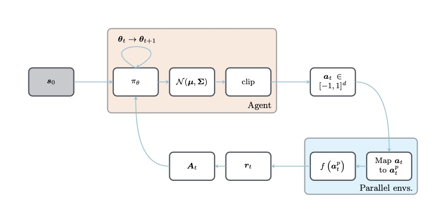

## Tikz1

| [**`random.tex`**](Tikz1/data/random/random.tex)              | [**`network.tex`**](Tikz1/data/network/network.tex)           |
| :-----------------------------------------------------: | :-----------------------------------------------------: |
|                        |                     |
| [**`cnn.tex`**](Tikz1/data/cnn/cnn.tex)                       | [**`turek.tex`**](Tikz1/data/turek/turek.tex)                 |
|                                 |                           |
| [**`workflow.tex`**](Tikz1/data/workflow/workflow.tex)        | [**`lorenz.tex`**](Tikz1/data/lorenz/lorenz.tex)              |
|                  |                        |
| [**`git.tex`**](Tikz1/data/git/git.tex)                       | [**`minted.tex`**](Tikz1/data/minted/minted.tex)              |
|                                 |                        |
| [**`timeline.tex`**](Tikz1/data/timeline/timeline.tex)        | [**`control.tex`**](Tikz1/data/control/control.tex)           |
|                  |                     |
| [**`letter.tex`**](Tikz1/data/letter/letter.tex)              | [**`beamer.tex`**](Tikz1/data/beamer/beamer.tex)              |
|                        |                        |
| [**`cfef.tex`**](Tikz1/data/cfef/cfef.tex)                    | [**`rosenbrock.tex`**](Tikz1/data/rosenbrock/rosenbrock.tex)  |
|                              |            |
| [**`kdtree.tex`**](Tikz1/data/kdtree/kdtree.tex)              | [**`interface.tex`**](Tikz1/data/interface/interface.tex)     |
|                        |               |
| [**`maxwell.tex`**](Tikz1/data/maxwell/maxwell.tex)           | [**`slab.tex`**](Tikz1/data/slab/slab.tex)                    |
|                     |                              |
| [**`oblique.tex`**](Tikz1/data/oblique/oblique.tex)           |                                                               |
|                     |                                                               |
     
## Tikz2

| &emsp;&emsp;&emsp;&emsp;&emsp;&emsp;&emsp;&emsp;&emsp;&emsp;&emsp;&emsp;&emsp;&emsp;&emsp;&emsp;&emsp;&emsp;&emsp;&emsp;&emsp;&emsp; | &emsp;&emsp;&emsp;&emsp;&emsp;&emsp;&emsp;&emsp;&emsp;&emsp;&emsp;&emsp;&emsp;&emsp;&emsp;&emsp;&emsp;&emsp;&emsp;&emsp;&emsp;&emsp; |
| :----------------------------------------------------------------------------------------------------------------------------------: | :----------------------------------------------------------------------------------------------------------------------------------: |
|                                      [`autoencoder`](Tikz2/assets/autoencoder/autoencoder.tex)                                      |                                           [`aviary`](Tikz2/assets/aviary/aviary.tex)                                           |
|                                                                              |                                                                                             |
|                               [`basis-plus-lattice`](Tikz2/assets/basis-plus-lattice/basis-plus-lattice.tex)                               |                                     [`bloch-sphere`](Tikz2/assets/bloch-sphere/bloch-sphere.tex)                                     |
|                                                         |                                                                           |
|                    [`bose-einstein-distribution-3d`](Tikz2/assets/bose-einstein-distribution-3d/bose-einstein-distribution-3d.tex)                    |                       [`bose-einstein-distribution`](Tikz2/assets/bose-einstein-distribution/bose-einstein-distribution.tex)                       |
|                        |                                 |
|                                 [`branch-and-bound`](Tikz2/assets/branch-and-bound/branch-and-bound.tex)                                 |                                    [`branch-cuts-1`](Tikz2/assets/branch-cuts-1/branch-cuts-1.tex)                                    |
|                                                               |                                                                        |
|                                    [`branch-cuts-2`](Tikz2/assets/branch-cuts-2/branch-cuts-2.tex)                                    |                              [`change-of-variables`](Tikz2/assets/change-of-variables/change-of-variables.tex)                              |
|                                                                        |                                                      |
|                         [`closed-string-topologies`](Tikz2/assets/closed-string-topologies/closed-string-topologies.tex)                         |                            [`complex-sign-function`](Tikz2/assets/complex-sign-function/complex-sign-function.tex)                            |
|                                       |                                                |
|                                [`concave-functions`](Tikz2/assets/concave-functions/concave-functions.tex)                                |                                           [`conv2d`](Tikz2/assets/conv2d/conv2d.tex)                                           |
|                                                            |                                                                                             |
|                                 [`convex-functions`](Tikz2/assets/convex-functions/convex-functions.tex)                                 |                             [`critical-temperature`](Tikz2/assets/critical-temperature/critical-temperature.tex)                             |
|                                                               |                                                   |
|                                      [`cylinder-to-plane`](Tikz2/assets/cylinder-to-plane/cylinder-to-plane.tex)                                      |                                           [`detailed-balance`](Tikz2/assets/detailed-balance/detailed-balance.tex)                                           |
|                                                                              |                                                                                             |
|                               [`dft-choices`](Tikz2/assets/dft-choices/dft-choices.tex)                               |                                     [`diagrams`](Tikz2/assets/diagrams/diagrams.tex)                                     |
|                                                         |                                                                           |
|                    [`disk-to-plane`](Tikz2/assets/disk-to-plane/disk-to-plane.tex)                    |                       [`divergence`](Tikz2/assets/divergence/divergence.tex)                       |
|                        |                                 |
|                                 [`dropout`](Tikz2/assets/dropout/dropout.tex)                                 |                                    [`energy-distribution-functions`](Tikz2/assets/energy-distribution-functions/energy-distribution-functions.tex)                                    |
|                                                               |                                                                        |
|                                    [`ergodic`](Tikz2/assets/ergodic/ergodic.tex)                                    |                              [`euler-angles`](Tikz2/assets/euler-angles/euler-angles.tex)                              |
|                                                                        |                                                      |
|                         [`fermi-dirac-vs-temp`](Tikz2/assets/fermi-dirac-vs-temp/fermi-dirac-vs-temp.tex)                         |                            [`feynman-1`](Tikz2/assets/feynman-1/feynman-1.tex)                            |
|                                       |                                                |
|                                [`feynman-2`](Tikz2/assets/feynman-2/feynman-2.tex)                                |                                           [`feynman-3`](Tikz2/assets/feynman-3/feynman-3.tex)                                           |
|                                                            |                                                                                             |
|                                 [`feynman-4`](Tikz2/assets/feynman-4/feynman-4.tex)                                 |                             [`feynman-diagram-propagator-loop`](Tikz2/assets/feynman-diagram-propagator-loop/feynman-diagram-propagator-loop.tex)                             |
|                                                               |                                                   |
| [`fluctuations`](Tikz2/assets/fluctuations/fluctuations.tex) | [`four-vs-of-data`](Tikz2/assets/four-vs-of-data/four-vs-of-data.tex) |
|  |  |
| [`gan`](Tikz2/assets/gan/gan.tex) | [`geometric-bayes`](Tikz2/assets/geometric-bayes/geometric-bayes.tex) |
|  |  |
| [`graph-isomorphism`](Tikz2/assets/graph-isomorphism/graph-isomorphism.tex) | [`gravitons`](Tikz2/assets/gravitons/gravitons.tex) |
|  |  |
| [`harm-osc-energy-freq`](Tikz2/assets/harm-osc-energy-freq/harm-osc-energy-freq.tex) | [`harm-osc-energy-inv-temp`](Tikz2/assets/harm-osc-energy-inv-temp/harm-osc-energy-inv-temp.tex) |
|  |  |
| [`hea`](Tikz2/assets/hea/hea.tex) | [`heatmap`](Tikz2/assets/heatmap/heatmap.tex) |
|  |  |
| [`higgs-potential`](Tikz2/assets/higgs-potential/higgs-potential.tex) | [`isotherms`](Tikz2/assets/isotherms/isotherms.tex) |
|  |  |
| [`jensens-inequality`](Tikz2/assets/jensens-inequality/jensens-inequality.tex) | [`k-space`](Tikz2/assets/k-space/k-space.tex) |
|  |  |
| [`kohn-sham-cycle`](Tikz2/assets/kohn-sham-cycle/kohn-sham-cycle.tex) | [`loop`](Tikz2/assets/loop/loop.tex) |
|  |  |
| [`loops`](Tikz2/assets/loops/loops.tex) | [`m-theory`](Tikz2/assets/m-theory/m-theory.tex) |
|  |  |
| [`made`](Tikz2/assets/made/made.tex) | [`maf`](Tikz2/assets/maf/maf.tex) |
|  |  |
| [`materials-informatics-challenges`](Tikz2/assets/materials-informatics-challenges/materials-informatics-challenges.tex) | [`materials-informatics`](Tikz2/assets/materials-informatics/materials-informatics.tex) |
|  |  |
| [`matsubara-contour-1`](Tikz2/assets/matsubara-contour-1/matsubara-contour-1.tex) | [`matsubara-contour-2`](Tikz2/assets/matsubara-contour-2/matsubara-contour-2.tex) |
|  |  |
| [`matsubara-contour-3`](Tikz2/assets/matsubara-contour-3/matsubara-contour-3.tex) | [`matsubara-contour-4`](Tikz2/assets/matsubara-contour-4/matsubara-contour-4.tex) |
|  |  |
| [`matsubara-contour-5`](Tikz2/assets/matsubara-contour-5/matsubara-contour-5.tex) | [`matsubara-contour-deformation`](Tikz2/assets/matsubara-contour-deformation/matsubara-contour-deformation.tex) |
|  |  |
| [`maxwell-boltzmann-distribution`](Tikz2/assets/maxwell-boltzmann-distribution/maxwell-boltzmann-distribution.tex) | [`mexican-hat`](Tikz2/assets/mexican-hat/mexican-hat.tex) |
|  |  |
| [`ml-activations`](Tikz2/assets/ml-activations/ml-activations.tex) | [`mosfet`](Tikz2/assets/mosfet/mosfet.tex) |
|  |  |
| [`mphil-gantt`](Tikz2/assets/mphil-gantt/mphil-gantt.tex) | [`nf-coupling-layer`](Tikz2/assets/nf-coupling-layer/nf-coupling-layer.tex) |
|  |  |
| [`normalizing-flow`](Tikz2/assets/normalizing-flow/normalizing-flow.tex) | [`one-point`](Tikz2/assets/one-point/one-point.tex) |
|  |  |
| [`open-string-topologies`](Tikz2/assets/open-string-topologies/open-string-topologies.tex) | [`operator-orderings`](Tikz2/assets/operator-orderings/operator-orderings.tex) |
|  |  |
| [`organic-molecule`](Tikz2/assets/organic-molecule/organic-molecule.tex) | [`otto-cycle`](Tikz2/assets/otto-cycle/otto-cycle.tex) |
|  |  |
| [`periodic-table`](Tikz2/assets/periodic-table/periodic-table.tex) | [`physics-mindmap`](Tikz2/assets/physics-mindmap/physics-mindmap.tex) |
|  |  |
| [`plane-to-torus`](Tikz2/assets/plane-to-torus/plane-to-torus.tex) | [`plate-capacitor`](Tikz2/assets/plate-capacitor/plate-capacitor.tex) |
|  |  |
| [`poles`](Tikz2/assets/poles/poles.tex) | [`potential-triangle`](Tikz2/assets/potential-triangle/potential-triangle.tex) |
|  |  |
| [`propagator-fluctuations`](Tikz2/assets/propagator-fluctuations/propagator-fluctuations.tex) | [`propagators`](Tikz2/assets/propagators/propagators.tex) |
|  |  |
| [`qm-cost-vs-acc`](Tikz2/assets/qm-cost-vs-acc/qm-cost-vs-acc.tex) | [`random-forest`](Tikz2/assets/random-forest/random-forest.tex) |
|  |  |
| [`regular-vs-bayes-nn`](Tikz2/assets/regular-vs-bayes-nn/regular-vs-bayes-nn.tex) | [`relation-space`](Tikz2/assets/relation-space/relation-space.tex) |
|  |  |
| [`rnvp`](Tikz2/assets/rnvp/rnvp.tex) | [`roost-update`](Tikz2/assets/roost-update/roost-update.tex) |
|  |  |
| [`sabatier-principle`](Tikz2/assets/sabatier-principle/sabatier-principle.tex) | [`saddle-point`](Tikz2/assets/saddle-point/saddle-point.tex) |
|  |  |
| [`sbs-aktionen`](Tikz2/assets/sbs-aktionen/sbs-aktionen.tex) | [`seebeck-effect`](Tikz2/assets/seebeck-effect/seebeck-effect.tex) |
|  |  |
| [`self-attention`](Tikz2/assets/self-attention/self-attention.tex) | [`shell`](Tikz2/assets/shell/shell.tex) |
|  |  |
| [`sign-plane`](Tikz2/assets/sign-plane/sign-plane.tex) | [`single-head-attention`](Tikz2/assets/single-head-attention/single-head-attention.tex) |
|  |  |
| [`skip-connection`](Tikz2/assets/skip-connection/skip-connection.tex) | [`spontaneous-magnetization`](Tikz2/assets/spontaneous-magnetization/spontaneous-magnetization.tex) |
|  |  |
| [`tanh`](Tikz2/assets/tanh/tanh.tex) | [`theory-space`](Tikz2/assets/theory-space/theory-space.tex) |
|  |  |
| [`thermo-ensemble-trafos`](Tikz2/assets/thermo-ensemble-trafos/thermo-ensemble-trafos.tex) | [`thomson-scattering`](Tikz2/assets/thomson-scattering/thomson-scattering.tex) |
|  |  |
| [`tori`](Tikz2/assets/tori/tori.tex) | [`torus-fundamental-domain`](Tikz2/assets/torus-fundamental-domain/torus-fundamental-domain.tex) |
|  |  |
| [`torus`](Tikz2/assets/torus/torus.tex) | [`two-point-no-cutoff`](Tikz2/assets/two-point-no-cutoff/two-point-no-cutoff.tex) |
|  |  |
| [`two-point`](Tikz2/assets/two-point/two-point.tex) | [`unregularized-propagator-diagrams`](Tikz2/assets/unregularized-propagator-diagrams/unregularized-propagator-diagrams.tex) |
|  |  |
| [`vae`](Tikz2/assets/vae/vae.tex) | [`wall`](Tikz2/assets/wall/wall.tex) |
|  |  |
| [`wetterich-equation`](Tikz2/assets/wetterich-equation/wetterich-equation.tex) | [`wyckoff-positions`](Tikz2/assets/wyckoff-positions/wyckoff-positions.tex) |
|  |  |
| [`zt-vs-n`](Tikz2/assets/zt-vs-n/zt-vs-n.tex) | &emsp;&emsp;&emsp;&emsp;&emsp;&emsp;&emsp;&emsp;&emsp;&emsp;&emsp;&emsp;&emsp;&emsp;&emsp;&emsp;&emsp;&emsp;&emsp;&emsp;&emsp;&emsp; |
|  | &emsp;&emsp;&emsp;&emsp;&emsp;&emsp;&emsp;&emsp;&emsp;&emsp;&emsp;&emsp;&emsp;&emsp;&emsp;&emsp;&emsp;&emsp;&emsp;&emsp;&emsp;&emsp; |

## Tikz3